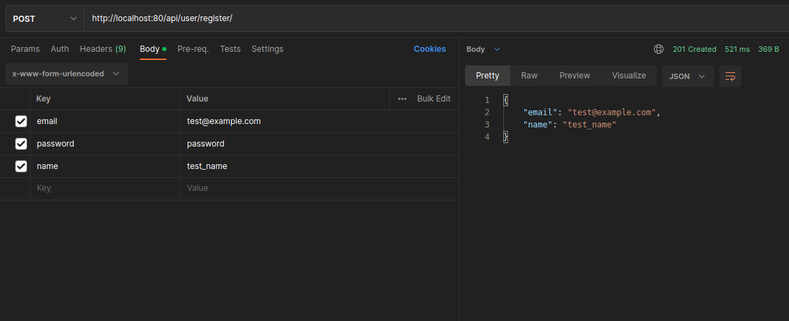
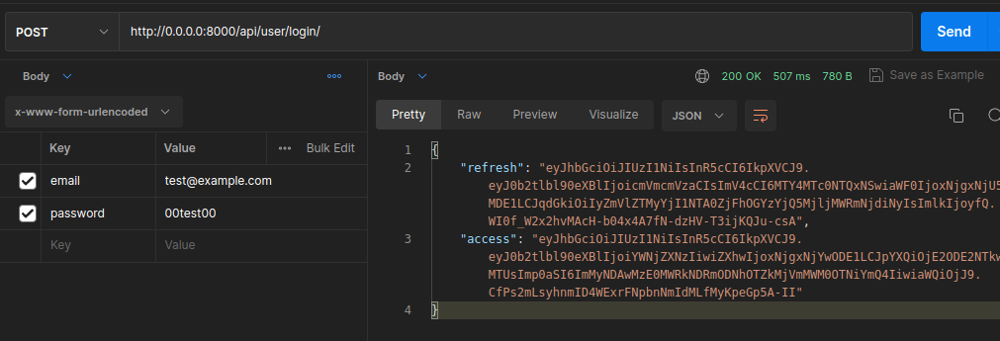
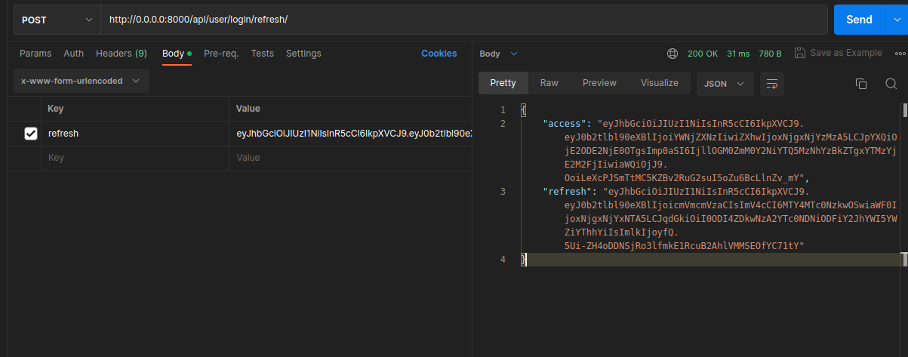
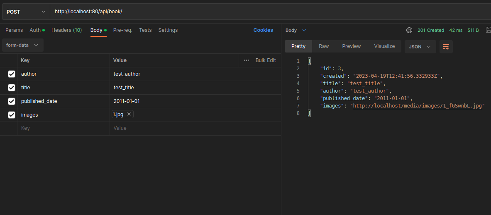
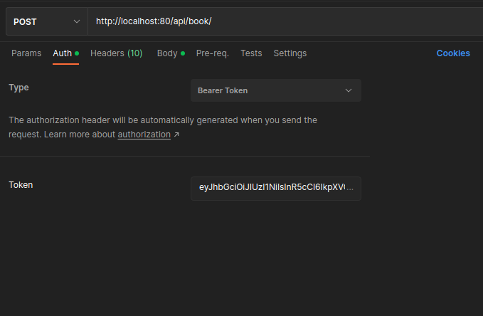

<h1>Book store API</h2

Django/ DRF API to manage books in a bookstore.<br>
Made with gitflow pattern and conventional commits convention.

## Explanation

All GET request are public (no authentication nor authorization needed).<br>
All POST/DEL/PATCH/PUT not public (authenticated by JWT and authorized to Admin user only).

## Table of content

* [Setup](#setup)
* [Interaction with the API](#interaction)
    - [User API](#user_api)
    - [Book API](#book_api)
* [Security](#security)
* [Tests](#tests)

## Setup

### Prerequisites:

* python 3.X
* Docker and docker-compose

### Install

a) Install codebase:

```
$ git clone https://github.com/forDeFan/book_store_api.git
$ cd book_store_api
```
b) <strong>IMPORTANT</strong> rename .env_example to .env (variables value can be changed or leaved as is) - docker and app itself fetch envinrometals from .env

c) Build and run the app (command given from same level where docker-compose and .env resides)

```
$ docker-compose up -d --build
```
<br>

## Interaction

For reviewer convenience admin and regular user are created at app start (thru django command).
Some book records added also - to perform basic operations at app start.
<br>
Admin endpoint/panel also implemented for convenience (if needed). 
<br>

Default credentials:

admin@example.com : password<br>
user@example.com : password
<br><br>
If new Admin user needed - create it thru docker-compose in Django CLI

```
$ docker-compose run --rm app sh -c "python manage.py createsuperuser"
```

<br>

### User_API

Django Admin panel (default admin credentials can be used here)

http://localhost:8000/admin


1. CREATE new non admin user.

POST to http://0.0.0.0:8000/api/user/register/

```
POST /api/user/register/ HTTP/1.1
Host: 0.0.0.0:8000
Content-Type: application/x-www-form-urlencoded

email=test@example.com&password=00test00&name=test_name
```




2. LOGIN to service as non admin user (JWT received in response body)

POST to http://0.0.0.0:8000/api/user/login/

```
POST /api/user/login/ HTTP/1.1
Host: 0.0.0.0:8000
Content-Type: application/x-www-form-urlencoded

email=test@example.com&password=00test00
```


3. REFRESH token (taken from login), new pair of acces/ refresh token will be returned in response.

POST to http://0.0.0.0:8000/api/user/login/refresh/

```
POST /api/user/login/refresh/ HTTP/1.1
Host: 0.0.0.0:8000
Content-Type: application/x-www-form-urlencoded

refresh=refresh_jwt_token
```



### Book_API

1. GET list of all books

public GET to http://0.0.0.0:8000/api/book/

2. FILTER thru existing books

public GET to http://0.0.0.0:8000/api/book/?title=title-to-search-for
<br>or<br>
public GET to http://0.0.0.0:8000/api/book/?author=author-to-search-for
<br>or<br>
public GET to http://0.0.0.0:8000/api/book/?title=title-to-search-for&author=author-to-search-for

3. ADD a book (must be admin user or got unathiorized - when regular user)

POST to http://0.0.0.0:8000/api/book/

<br>
JWT must be provided in header.
<br>
Body have to be selected as form-data and images field must be selected as file.


```
POST /api/book/ HTTP/1.1
Host: 0.0.0.0:8000
Authorization: Bearer {jwt_token_here}
Content-Type: multi-part/form-data
Content-Disposition: form-data; name="images"; filename="your_image"

```

 

4. UPDATE a book (must be admin user or got unathiorized - when regular user)
<br>
JWT must be provided in header.
<br>


5. DELETE a book (must be admin user or got unathiorized - when regular user)


## Security

App log in/out proces is managed thru JWT in DRF.<br>
JWT tokens last for 30 mins after that had to be refreshed on POST to <br>
http://0.0.0.0:8000/api/user/login/refresh/ <br>
With JWT refresh token received at login.
<br><br>
All secret data (environmental variables) are set in .env file from which the app and docker fetch them up when needed (see .nev-example).

## Tests
Fired up thru docker-compose. Made in Pytest.

```
$ docker-compose run --rm app sh -c "python manage.py test"
```